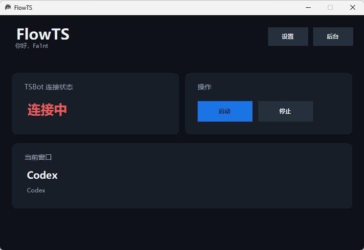

# FlowTS

FlowTS 是一个 Windows 桌面工具，可以把电脑当前正在使用的软件同步到 TeamSpeak bot 昵称中。

它不是 ServerQuery bot，也不需要额外运行 TS3AudioBot 程序。FlowTS 内置基于 TS3AudioBot `TSLib` 的 TeamSpeak 客户端 bot，连接服务器后会检测当前前台窗口，并自动更新 bot 昵称。

## 程序截图



## 核心功能

- 原生 Windows GUI，支持托盘后台运行。
- 内置真实 TeamSpeak 客户端 bot。
- 自动识别当前前台应用，并优先显示更友好的应用名称。
- 支持服务器地址、域名、端口、服务器密码、默认频道和频道密码。
- 支持自定义 bot 昵称与昵称模板。
- 支持开机后台自启动和启动后自动连接。
- 支持 Dev Mode 调试日志开关。
- 固定窗口尺寸，避免缩放导致界面错位。
- 提供 Windows x64 自包含单文件版本。

## 下载与运行

前往 GitHub Releases 下载最新版本：

```text
FlowTS-v0.1.0-win-x64.zip
```

解压后运行：

```text
FlowTS.exe
```

后台模式启动：

```text
FlowTS.exe --background
```

## 基本使用

1. 打开 FlowTS。
2. 点击 `设置`。
3. 填写 TeamSpeak 服务器地址、端口、密码、默认频道等信息。
4. 设置 bot 昵称和昵称模板。
5. 保存设置后回到主界面，点击 `启动`。

启用后台模式后，关闭窗口会将程序隐藏到系统托盘。需要完全退出时，请右键托盘中的 FlowTS 图标并选择 `退出`。

## 昵称模板

默认模板：

```text
{bot} | {app}
```

可用变量：

- `{bot}`：设置中的 bot 昵称。
- `{app}`：当前前台应用名称。
- `{title}`：当前前台窗口标题。
- `{short_title}`：缩短后的窗口标题。
- `{process}`：进程名。

TeamSpeak 昵称存在长度限制，FlowTS 会在必要时自动裁剪最终昵称。

## 后台与自启动

FlowTS 支持以下后台相关选项：

- `关闭或最小化时进入后台`：窗口关闭或最小化时隐藏到系统托盘。
- `开机后台自启动`：写入当前用户的 Windows 启动项。
- `启动后自动连接 TSBot`：程序启动后自动连接 TeamSpeak bot。

开机启动项写入当前用户注册表，不需要管理员权限：

```text
HKEY_CURRENT_USER\Software\Microsoft\Windows\CurrentVersion\Run
```

## 从源码构建

构建要求：

- Windows x64。
- .NET SDK 8.0。

如果本机没有安装 .NET SDK，可以运行：

```text
Install-DotNet-SDK.cmd
```

构建 Windows x64 自包含版本：

```text
Build-FlowTS-Native-Exe.cmd
```

输出文件：

```text
dist\FlowTS\FlowTS.exe
```

## 图标征集

FlowTS 正在征集一个更适合项目定位的专属 App 图标。

当前版本使用的是临时图标。如果你愿意为 FlowTS 设计图标，欢迎通过 issue 或 pull request 提交方案。理想的图标应当简洁、小尺寸下容易识别，并能体现 FlowTS 作为 TeamSpeak 状态桥接工具的定位。

## 第三方组件

FlowTS 使用了 TS3AudioBot 项目中的 `TSLib`，并包含 `libopus.dll`。详情见：

```text
THIRD_PARTY_NOTICES.md
```

## 配置与安全

FlowTS 会在 exe 同目录生成配置文件：

```text
flowts-client-config.json
```

如果没有启用 `保存密码到本地`，服务器密码和频道密码不会写入配置文件。

## 许可证

FlowTS 自身的项目许可证暂未最终确定。第三方组件的许可证文件已保留在 `vendor/` 目录，并在 `THIRD_PARTY_NOTICES.md` 中说明。
